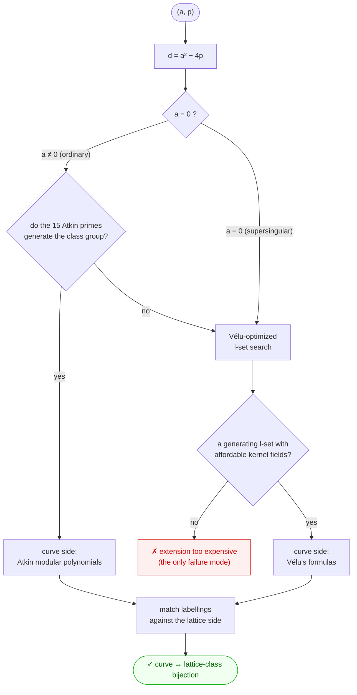

# ecfplat

Code supporting computations related to elliptic curves over finite fields via an explicit bijection between lattice classes and elliptic curves in a given isogeny class.

The lattice point data produced here is used as input for shader-rendered artwork by Nadir Hajouji and Steve Trettel, displayed at [elliptic-curves.art](https://elliptic-curves.art/).

## Overview

Given a pair `(a, p)` with `p` prime and `a² < 4p`, the code works with the isogeny class of elliptic curves over $\mathbb{F}_p$ whose Frobenius has characteristic polynomial `x² - ax + p`. The central object is an explicit bijection between:

- **Lattice classes** with CM by a root of `x² - ax + p` (equivalently, classes of positive definite binary quadratic forms of discriminant `a² - 4p`)
- **Elliptic curves** in the corresponding isogeny class over $\mathbb{F}_p$

There are two layers to the code, and it helps to keep them apart:

- **Computing a bijection from scratch.** Given `(a, p)`, the library runs the full pipeline below and returns the curve ↔ lattice-class bijection. The ordinary driver is `ecqf_full_bijection_ord`; the supersingular driver is `ecqf_full_bijection_ss`. This end-to-end computation has been run and checked for every prime `p` with `4 ≤ p ≤ 1024` — the supersingular bijection is computed for all such primes, and the ordinary bijections match the trusted tables (see [Validation](#validation)). It is expected to work in general; coverage beyond that range is still being tested.
- **Using a bijection.** Downstream applications (`ECQFIsogenyClass`) take a bijection as their *input* and read off properties of the curves — e.g. Mordell–Weil group structure, isogeny graphs — by working on the lattice side. For speed these mostly load a **precomputed** bijection (itself produced by the algorithms here and stored under `pycode/data/`), but any bijection, freshly computed or loaded, works the same way.

### Computing the bijection: the pipeline



Given a pair `(a, p)`:

1. **Discriminant.** Form `d = a² − 4p`, the discriminant of the CM order `ℤ[π]` generated by Frobenius `π`. (In the supersingular case `a = 0`: `π = √−p`, and the relevant orders live in `ℚ(√−p)` — `ℤ[√−p]` of discriminant `−4p` and, when `p ≡ 3 (mod 4)`, the maximal order of discriminant `−p`, the two linked by a depth-1 2-isogeny volcano.)
2. **Search for a rigid l-set, and choose the curve-side method.** Find primes `ℓ` whose `ℓ`-isogeny directions form an *independent generating set* of the class group — together, when there are two or more directions of order > 2, with a "sum"/pinning element that fixes the relative orientation of the cycles.
   - For an **ordinary** class the search first uses the 15 Atkin primes `{2, …, 71}` (`disc_rigid_lset_search`). If they generate the class group, the curve side is read directly off Atkin modular polynomials — no isogeny is computed.
   - If they do not — and always in the **supersingular** case — the search instead draws on a much larger pool of cheap split primes that Vélu can handle, ranked by the size of the extension field each kernel needs. (`disc_rigid_lset_search` accepts any such pool; `ss_rigid_lset` builds and runs that Vélu-optimised pool automatically for the supersingular classes.)
   Because that Vélu pool is effectively unlimited, a generating set always exists, so the search itself does not fail; it only comes up empty when *no* generating set is cheap enough — which is the single failure mode below.
3. **Collect neighbour data.** Build `ℓ`-isogeny adjacency on both sides for each chosen `ℓ`. The *lattice side* is the class-group action on quadratic forms (pure form arithmetic — never an obstruction). The *curve side* is read off Atkin modular polynomials when the l-set came from the 15 Atkin primes, and otherwise computed explicitly with **Vélu's formulas**. ⚠️ *This is the pipeline's only real failure mode:* Vélu needs an `ℓ`-torsion kernel living over an extension $\mathbb{F}_{p^k}$, and when `k` is large the computation is infeasible — so a class is out of reach precisely when every generating l-set forces a too-expensive kernel field.
4. **Match the labellings.** Walking the chosen directions assigns every object an integer-tuple coordinate `(x₁, …, xₙ)`; matching the lattice-side and curve-side labellings coordinate-by-coordinate yields the bijection. A single global orientation freedom (complex conjugation / class-group inversion) is pinned by a deterministic convention.

The Vélu isogeny engine is `pycode/velu.py`; the rigid-l-set search and both bijection drivers are in `pycode/ecqf_bij.py`; the coordinate-labelling/cube machinery is in `pycode/graph_tools.py`.

### The supersingular case

Restricting to isogenies and endomorphisms defined over $\mathbb{F}_p$, the supersingular classes are again an *oriented CM* picture — by an order in `ℚ(√−p)` — so the same class-group machinery applies. The objects are **signatures** `(j, s)`, where `s = ±1` distinguishes a curve from its quadratic twist (the $\mathbb{F}_p$-isomorphism class). Frobenius has trace 0, so all curve-side neighbour data comes from Vélu: split-eigenline `ℓ`-isogenies for odd `ℓ`, and rational 2-torsion 2-isogenies for the volcano structure. The driver `ecqf_full_bijection_ss(p)` dispatches on `p mod 8`: no volcano when `p ≡ 1 (mod 4)`, and a surface/floor 2-volcano (sizes `1:1` for `p ≡ 7 (mod 8)`, `1:3` for `p ≡ 3 (mod 8)`) otherwise. `ss_bij_cache.py` rebuilds the whole supersingular dataset from scratch.

## Repository structure

```
notebooks/        # Jupyter notebooks (published)
  userguide.ipynb     # Worked examples and basic use cases

experiments/      # Local scratch notebooks (not tracked by git)

pages/            # Streamlit multi-page app pages
  0_Homepage.py       # Landing page with project description and navigation
  1_Isogeny_Class.py  # Isogeny class browser: bijection table, isogeny graph,
                      #   and cross-navigation to EC Search
  2_EC_Search.py      # Single-curve lookup: classical and lattice pictures,
                      #   point download, cross-navigation to Isogeny Class
  3_Background.py     # Crash course: interactive lecture tabs covering elliptic
                      #   curves over ℝ/𝔽ₚ/ℂ, isogenies, CM, and Frobenius

pycode/           # Core Python library
  alg_classes.py      # Algebraic structures: AbGrp/Ring/Field + elements, matrix
                      #   rings (Mat_n_Z), prime/extension fields (GF_p, GF_pn),
                      #   Polynomial/PolyFp
  nt.py               # Number theory utilities (gcd, primality, quadratic symbols,
                      #   Frobenius-eigenvalue / isogeny-kernel extension degrees, …)
  identities.py       # Algebraic identities used in isogeny computations
  qfs.py              # Quadratic form / lattice utilities and modular group action
  modularpolynomials.py  # Atkin and Hilbert modular polynomial data and evaluation
  ecfp.py             # Elliptic curves over F_p (j-invariants, models, isogeny
                      #   graphs, Frobenius; Atkin-vs-Velu neighbour-data dispatch)
  velu.py             # Field-generic Velu isogeny engine: EC arithmetic, codomains,
                      #   l-isogeny eigenline kernels over F_{p^k}, 2-isogenies,
                      #   ordinary and supersingular neighbour-data providers
  ecqf_bij.py         # Rigid l-set search and the lattice <-> curve bijection drivers,
                      #   ordinary (ecqf_full_bijection_ord) and supersingular
                      #   (ecqf_full_bijection_ss); disc_rigid_lset_search, ss_rigid_lset
  rigid_cache.py      # Per-discriminant cache (search + lattice-side bijection) with
                      #   a populate/update CLI and a cached (a, p) entrypoint
  ldata_cache.py      # Per-discriminant rigid-l-set-data cache + populate/update CLI
  ss_bij_cache.py     # Recompute the supersingular bijection from scratch over a prime
                      #   range into the (Velu) data files + populate/update CLI
  ecqf_tools.py       # Bijection utilities, Frobenius matrices, Mordell–Weil
                      #   computations, ECQFIsogenyClass, precomputed-table loaders
  ecqf.py             # Legacy utilities and precomputed-table loading (the bijection
                      #   algorithms now live in ecqf_bij.py)
  graph_tools.py      # Isogeny graph utilities: adjacency matrices, cycle/tree
                      #   decompositions, the Zⁿ labelling algorithm
  graphic_tools.py    # Helpers for the lattice-point artwork output
  misctools.py        # Small shared utilities (dict composition, tuple helpers)
  data/               # Precomputed JSON (see "Precomputed data")
```

## Web app

A Streamlit app provides a point-and-click interface:

```bash
pip install -r requirements.txt
streamlit run app.py
```

The app has four pages:

- **Homepage** — project description and links to the two main tools.
- **Background** — crash course on the underlying mathematics, with interactive applets. Currently implemented: chord-tangent group law on elliptic curves over ℝ, and a τ explorer for the complex lattice ℂ/Λ.
- **EC Search** — enter coefficients `(f, g, p)` for a curve `y² = x³ + fx + g (mod p)`, look up its trace of Frobenius and associated lattice data, view classical and lattice pictures, and navigate directly to its isogeny class.
- **Isogeny Class** — enter a pair `(a, p)`, browse the full bijection table, view degree-ℓ isogeny graphs (adjacency matrix + concentric-ring picture with horizontal/vertical edges distinguished by colour), and navigate to any individual curve in EC Search.

## Getting started (library)

Install dependencies:

```bash
pip install -r requirements.txt
```

Open the user guide:

```bash
jupyter notebook notebooks/userguide.ipynb
```

The notebook walks through:
- Checking whether a pair `(a, p)` has precomputed data
- Initializing an `ECQFIsogenyClass` object
- Viewing the bijection as a pandas DataFrame
- Visualizing lattice classes in the upper half-plane
- Computing Mordell–Weil group data from the lattice side

### Quick example

*Using a bijection* (loads precomputed data when available):

```python
import sys
sys.path.insert(0, 'pycode/')
from ecqf_tools import ECQFIsogenyClass, ap_in_pc_data

# Check if (a=22, p=1021) is in the precomputed data
ap_in_pc_data((22, 1021))   # True

# Load the isogeny class
isoclass = ECQFIsogenyClass(22, 1021)

# View all lattice classes and their corresponding elliptic curve data
isoclass.ecqf_df()

# Compute the degree-5 isogeny graph adjacency matrix
isoclass.adjacency_matrix(5)
```

*Computing a bijection from scratch* (no precomputed data needed):

```python
import sys
sys.path.insert(0, 'pycode/')
from ecqf_bij import ecqf_full_bijection_ord, ecqf_full_bijection_ss, disc_ldata

# Ordinary class (a, p): {j-invariant: quadratic form (a, b, c)}
a, p = 1, 103
ls = disc_ldata(a * a - 4 * p)['ls_rig']   # a rigid l-set for d = a^2 - 4p
ecqf_full_bijection_ord(a, p, ls)

# Supersingular class over F_p: {signature (j, s): quadratic form (a, b, c)}
ecqf_full_bijection_ss(307)                # picks its own rigid l-set
```

## Precomputed data

`pycode/data/` holds two layers of precomputed results, plus supporting modular-polynomial tables.

**Per-`(a, p)` bijections** — the end product, the full curve ↔ lattice-class bijection for each pair:
- `ecqf_ord_pcbij_4_1024.json` — ordinary classes, **6 725** pairs `(a, p)` with `4 ≤ p ≤ 1024`.
- `ecqf_ss_pcbij_4_1024_INC.json` — supersingular classes computed in Sage early in the project, keyed by prime `p` (158 keys; some primes were missing).
- `ecqf_ord_pcbij_4to256.json` — an earlier / smaller-range variant.

The supersingular bijection has since been **recomputed from scratch** with the Vélu pipeline (`ss_bij_cache.py`), independent of the original Sage tables and stored separately:
- `ecqf_ss_pcbij_velu_4_1024.json` — dict form `{p: {"(j, s)": [a, b, c]}}`, **all 170** supersingular primes in `4 ≤ p ≤ 1024` (the 12 the Sage tables were missing are now included).
- `ssfp_pc_bij_velu.json` — the same data in list form `[[[j, s], [a, b, c]], …]`, kept in sync.

List available keys with `get_aps_pc()` / `get_ssps_pc()` and test membership with `ap_in_pc_data((a, p))` (all in `ecqf_tools.py`).

**Per-discriminant data** — the `(a, p)`-independent layer. The expensive lattice-side computation depends only on `d = a² − 4p`, so it is precomputed once per discriminant for **all 2 048** discriminants in `[−4096, −3]`:
- `qf_ldata.json` — the rigid l-set search result for each `d` (generating primes, their orders, the sum/pinning element). **2 036** of the 2 048 admit a rigid spanning set from the 15 supersingular primes `{2, …, 71}`; **14** of those need a prime-power generator `(ℓ, k)`; the remaining **12** have no rigid l-set in that 15-prime pool (the Vélu fallback in the pipeline above lifts this restriction, at the cost of computing isogenies explicitly).
- `rigid_lset_cache.json` — the same search data, plus the `(a, p)`-independent lattice-side labelling `(x₁, …, xₙ) ↦ (a, b, c)` for each `d`.

Both are regenerated/extended with incremental command-line tools (re-running only fills what is missing):

```bash
python pycode/rigid_cache.py --min -8192   # search + lattice-side bijection
python pycode/ldata_cache.py --min -8192   # search data only (smaller)
python pycode/ss_bij_cache.py --max 1024   # supersingular bijection, from scratch
```

**Modular-polynomial tables** — used to read $\mathbb{F}_p$ isogeny adjacency without computing isogenies:
- `atkinpolys.json` — Atkin modular polynomials for the 15 primes `ℓ ∈ {2, …, 71}` whose Atkin–Lehner quotient `X₀(ℓ)⁺` has genus 0 (the supersingular primes).
- `hilbpolys.json`, `jcoefs.json` — Hilbert class polynomials and related data for small discriminants.

### Validation

The **ordinary** per-discriminant data has been checked as follows:

- **Determinism / cache integrity.** The lattice-side labelling is a deterministic function of `d`, so a cached entry reproduces a fresh recomputation *exactly*; verified across the cached range and through a JSON round-trip.
- **Bijectivity.** Every successful search result yields a *complete* bijection of the class group (injective and onto), confirmed by reconstructing the lattice-side labelling for all 2 036 solved discriminants.
- **Regression against the trusted tables.** Rebuilding each `(a, p)` bijection from the per-discriminant cache reproduces the stored `ecqf_ord_pcbij_4_1024.json` for **3 913** of the 6 725 pairs and its exact complex-conjugate for the other **2 812** — **0 disagreements**. (Both are valid bijections; the labelling is canonicalized to a fixed orientation, so the choice is consistent across pairs.)
- **Backward compatibility.** Extending the search to allow prime-power generators recovered the 14 additional discriminants noted above while leaving every prime-only result byte-identical (checked on a 300-discriminant sample).

The **supersingular** from-scratch recomputation has been checked against the original Sage tables on all **158** shared primes: every prime has the *same* signature set and the *same* set of lattice forms (so the two bijections match the same objects), with an exact label match on 53 and the rest differing only by the global orientation freedom. The neighbour-data engine was validated independently — signature/model round-trips and Vélu isogeny graphs agree with the lattice-side isogeny graphs — and the resulting bijections are equivariant, root-correct and twist-consistent. The 12 primes missing from the Sage tables are filled and pass the same checks.
