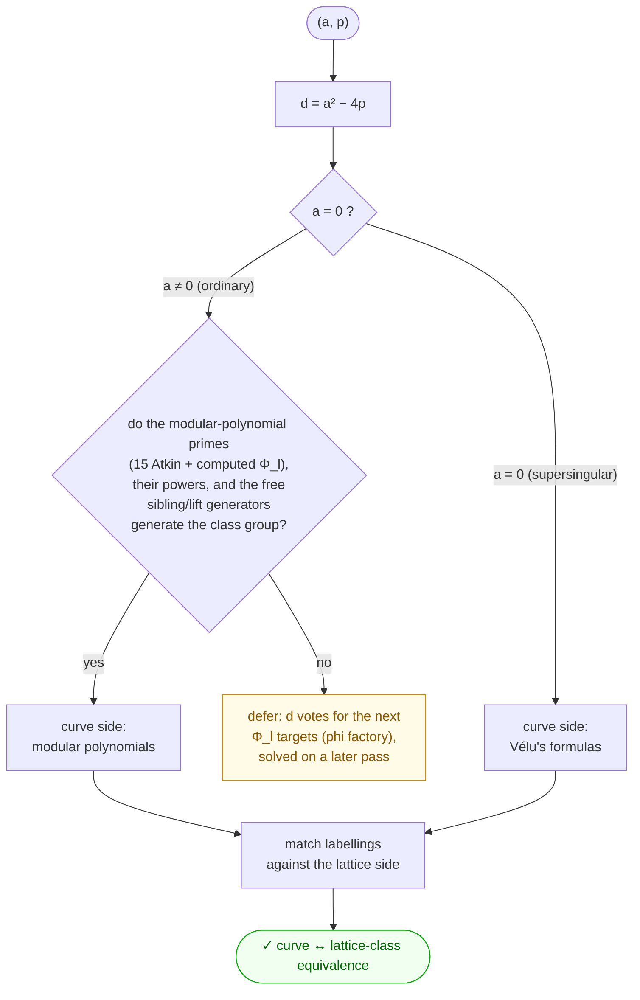

# ecfplat

Code supporting computations related to elliptic curves over finite fields via an explicit equivalence of categories between CM lattices and elliptic curves in a given isogeny class.

The lattice point data produced here is used as input for shader-rendered artwork by Nadir Hajouji and Steve Trettel, displayed at [elliptic-curves.art](https://elliptic-curves.art/).

## Overview

Given a pair `(a, p)` with `p` prime and `a² < 4p`, the code works with the isogeny class of elliptic curves over $\mathbb{F}_p$ whose Frobenius has characteristic polynomial `x² - ax + p`. The central object is an explicit **equivalence of categories** between elliptic curves in that isogeny class (with their $\mathbb{F}_p$-isogenies) and lattices with CM by a root of `x² - ax + p` (with their morphisms). Concretely, the code computes the induced correspondence on isomorphism classes:

- **Lattice classes** — classes of positive definite binary quadratic forms of discriminant `a² - 4p`
- **Elliptic curves** in the corresponding isogeny class over $\mathbb{F}_p$

There are two layers to the code, and it helps to keep them apart:

- **Computing an equivalence from scratch.** Given `(a, p)`, the library runs the pipeline below and returns the curve ↔ lattice-class correspondence. The ordinary driver is `ecqf_full_bijection_ord`; the supersingular driver is `ecqf_full_bijection_ss`. The ordinary computation has been run for **every computable class with `4 ≤ p ≤ 8192`** (117 155 classes — 99.86 % of the range; the rest await new modular polynomials, see below); the supersingular one for **all 1 026 primes in the same range**.
- **Using an equivalence.** Downstream applications (`ECQFIsogenyClass`) take an equivalence as their *input* and read off properties of the curves — e.g. Mordell–Weil group structure, isogeny graphs — by working on the lattice side. For speed these mostly load a **precomputed** equivalence (produced by the algorithms here and stored under `pycode/data/`), but any equivalence, freshly computed or loaded, works the same way.

### Computing the equivalence: the pipeline



Given a pair `(a, p)`:

1. **Discriminant.** Form `d = a² − 4p`, the discriminant of the CM order `ℤ[π]` generated by Frobenius `π`. (In the supersingular case `a = 0`: `π = √−p`, and the relevant orders live in `ℚ(√−p)` — `ℤ[√−p]` of discriminant `−4p` and, when `p ≡ 3 (mod 4)`, the maximal order of discriminant `−p`, the two linked by a depth-1 2-isogeny volcano.)
2. **Search for a rigid l-set.** Find generating directions whose walks form an *independent generating set* of the class group — together, when there are two or more directions of order > 2, with a pinning element that fixes the relative orientation of the cycles (`disc_rigid_lset_search`; the search backtracks over bases, and the pin may be *relaxed* to any full-support combination `Σ cᵢbᵢ + τ` with `0 < cᵢ < ord(bᵢ)/2` and `τ` a word in the order-2 generators). The pool has three kinds of directions:
   - **modular-polynomial primes** — the 15 Atkin primes `{2, …, 71}`, extended by every classical `Φ_ℓ` the phi factory has delivered;
   - prime **powers** `(ℓ, k)` — the element `k·x_ℓ`, read off the `ℓ`-cycle at no extra cost;
   - **free generators** from the conductor, needing no new modular polynomial: when `q ∈ {2, 3}` divides the conductor and the descent `Cl(O) → Cl(O_{c/q})` has kernel of order 2 or 3, the *q-sibling fibers* (classes sharing a `q`-parent) pin the kernel generator (`('sib', q)`); when that kernel is trivial, the crater's `x_q` conjugates down the unique descents to a floor generator (`('lift', q)`) — e.g. `d = −284 = −4·71` gets its complete equivalence from the 2-isogeny graph alone.
   
   When the search succeeds, the curve side is read directly off modular polynomials — **no isogeny is ever computed** for an ordinary class. One more conductor shortcut on the curve side: for `d = d₀·ℓ²` with `h(d₀) = 1`, the vertical structure at `ℓ` is trivial (a single identifiable crater vertex, the known CM point), so no `Φ_ℓ` is needed even when `ℓ` is outside the pool.
3. **Deferred classes.** When the pool does not generate the class group (a fraction of a percent of discriminants at the current pool), the discriminant joins the open list and *votes* for the modular polynomials that would unblock it (`vote_for_new_modpolys`); it is picked up on a later pass (`bootstrap_refresh`) once the phi factory has computed them. (Vélu's formulas remain available as a fallback in the code, but the pipeline no longer relies on them for ordinary classes.)
4. **Supersingular classes** are the one place Vélu's formulas are still essential: Frobenius has trace 0, so all curve-side neighbour data is computed as explicit isogenies (split-eigenline `ℓ`-isogenies over extension fields, rational 2-torsion 2-isogenies for the volcano). See below.
5. **Match the labellings.** Walking the chosen directions assigns every object an integer-tuple coordinate `(x₁, …, xₙ)`; matching the lattice-side and curve-side labellings coordinate-by-coordinate yields the equivalence. A single global orientation freedom (complex conjugation / class-group inversion) is pinned by a deterministic convention.

The rigid-l-set search and both drivers are in `pycode/ecqf_bij.py`; the Vélu isogeny engine is `pycode/velu.py`; the coordinate-labelling/cube machinery is in `pycode/graph_tools.py`.

### The factories: a bootstrapping loop

Three "run-all" notebooks (designed for long unattended runs on a second machine, everything checkpointed and resumable) grow the data in a cycle — each generation of computed objects becomes the tool that computes the next:

1. **Equivalence factory** (`notebooks/ord_factories/bij_factory.ipynb`) — enumerate all classes `(a, p)` for `p` in a target range, partition their discriminants by whether a rigid spanning set exists, compute and store every computable equivalence, and **tally the vote**: which new `Φ_ℓ` would unblock the most open discriminants.
2. **Phi factory** (`notebooks/ord_factories/phi_factory.ipynb`) — compute classical modular polynomials `Φ_l` by CRT interpolation *across the stored equivalences*: the general symmetric form is constrained by the diagonal `Φ_l(X,X) = −∏ H_d` (a product of Hilbert class polynomials), pinned per characteristic `p` by evaluations at `l`-isogenous pairs read off the lattice side, certified against the Bröker–Sutherland height bound, and checked against the Kronecker congruence. Each new `Φ_l` enlarges the pool in step 2 of the pipeline.
3. **Hilbert factory** (bottom of `bij_factory.ipynb`) — harvest every stored equivalence into certified Hilbert class polynomials `H_d` (roots of `H_d mod p` are read off the equivalences; balanced CRT with a numeric coefficient bound). These feed the phi factory's diagonal and special-value relations.
4. **Supersingular factory** (`notebooks/ss_factory/ss_factory.ipynb`) — extend the supersingular signature ↔ lattice equivalences over a prime range (`ss_bij_cache.populate`): rigid l-sets chosen by minimum Vélu eigenline degree, curve side via one-direction cycle walks, and every fresh entry gated by a validation battery (signature/form sets, genuine supersingularity, `Φ_ℓ` edge check at an unused split prime, root conventions) before it is stored.

The supporting library: `hilbert_crt.py` (Hilbert polynomials via CRT, endomorphism-ring identification), `modpoly_crt.py` (the `Φ_l` interpolation), `bij_factory.py` / `phi_factory.py` (the drivers), `trace_gpu.py` (optional CUDA/MPS backend for the trace-of-Frobenius tables).

### The supersingular case

Restricting to isogenies and endomorphisms defined over $\mathbb{F}_p$, the supersingular classes are again an *oriented CM* picture — by an order in `ℚ(√−p)` — so the same class-group machinery applies. The objects are **signatures** `(j, s)`, where `s = ±1` distinguishes a curve from its quadratic twist (the $\mathbb{F}_p$-isomorphism class). Frobenius has trace 0, so all curve-side neighbour data comes from Vélu: split-eigenline `ℓ`-isogenies for odd `ℓ`, and rational 2-torsion 2-isogenies for the volcano structure. The driver `ecqf_full_bijection_ss(p)` dispatches on `p mod 8`: no volcano when `p ≡ 1 (mod 4)`, and a surface/floor 2-volcano (sizes `1:1` for `p ≡ 7 (mod 8)`, `1:3` for `p ≡ 3 (mod 8)`) otherwise. `ss_bij_cache.py` rebuilds the whole supersingular dataset from scratch.

## Repository structure

```
notebooks/        # Jupyter notebooks (published)
  userguide.ipynb     # Worked examples and basic use cases
  ord_factories/      # Ordinary-side factories (run bij before phi)
    bij_factory.ipynb   # Equivalence factory: extend the precomputes over a prime
                        #   range + the modular-polynomial vote + the Hilbert factory
    phi_factory.ipynb   # Phi factory: batch classical modular polynomials Phi_l
  ss_factory/         # Supersingular factory
    ss_factory.ipynb    # Extend the SS signature <-> lattice bijections over a
                        #   prime range, every entry gated by the validation battery
  hilbcrt.ipynb       # Worked development notebook for the CRT machinery

experiments/      # Local scratch notebooks (not tracked by git)

pages/            # Streamlit multi-page app pages
  0_Homepage.py       # Landing page with project description and navigation
  1_Isogeny_Class.py  # Isogeny class browser: equivalence table, isogeny graph,
                      #   and cross-navigation to EC Search
  2_EC_Search.py      # Single-curve lookup: classical and lattice pictures,
                      #   point download, cross-navigation to Isogeny Class
  3_Background.py     # Crash course: interactive lecture tabs covering elliptic
                      #   curves over ℝ/𝔽ₚ/ℂ, isogenies, CM, and Frobenius

pycode/           # Core Python library
  alg_classes.py      # Algebraic structures: AbGrp/Ring/Field + elements, matrix
                      #   rings (Mat_n_Z), prime/extension fields (GF_p, GF_pn),
                      #   polynomial rings (poly_ring over ZZ/GF_p/GF_pn/CC, from_roots,
                      #   poly_crt) and the legacy Polynomial/PolyFp
  nt.py               # Number theory utilities (gcd, primality, quadratic symbols, CRT,
                      #   Frobenius-eigenvalue / isogeny-kernel extension degrees, …)
  identities.py       # Algebraic identities used in isogeny computations
  qfs.py              # Quadratic form / lattice utilities and modular group action
  modularpolynomials.py  # Atkin and Hilbert modular polynomial data and evaluation;
                      #   classical Phi_l(X,Y) from the j-function q-expansion
                      #   (compute_modpoly), eval + root-finding (modpoly_nbrs), cache
  hilbert_crt.py      # Hilbert class polynomials H_d via CRT from the equivalences;
                      #   endomorphism-ring identification (ancestor data + the
                      #   Hilbert-polynomial elimination trick); fail-or-compute search
  modpoly_crt.py      # Classical Phi_l via CRT interpolation: diagonal from H_d's,
                      #   isogenous-pair evaluations, special-value relations,
                      #   Broker-Sutherland certification, Kronecker check
  bij_factory.py      # Equivalence factory driver + the vote + the Hilbert factory
  phi_factory.py      # Phi factory driver (checkpointed CRT state, range predictor)
  ecfp.py             # Elliptic curves over F_p (j-invariants, models, isogeny
                      #   graphs, cached trace-of-Frobenius tables)
  velu.py             # Field-generic Velu isogeny engine: EC arithmetic, codomains,
                      #   l-isogeny eigenline kernels over F_{p^k}, 2-isogenies
  trace_gpu.py        # Optional CUDA/MPS backend for the trace tables (pytorch)
  ecqf_bij.py         # Rigid l-set search and the lattice <-> curve equivalence
                      #   drivers, ordinary and supersingular
  rigid_cache.py      # Per-discriminant cache (search + lattice-side labelling) with
                      #   a populate/update CLI and a cached (a, p) entrypoint
  ldata_cache.py      # Per-discriminant rigid-l-set-data cache + populate/update CLI
  ss_bij_cache.py     # Recompute the supersingular equivalence from scratch over a
                      #   prime range into the (Velu) data files + populate/update CLI
  ecqf_tools.py       # Equivalence utilities, Frobenius matrices, Mordell–Weil
                      #   computations, ECQFIsogenyClass, precomputed-table loaders
  ecqf.py             # Legacy utilities (the drivers now live in ecqf_bij.py)
  graph_tools.py      # Isogeny graph utilities: adjacency matrices, cycle/tree
                      #   decompositions, the Zⁿ labelling algorithm
  graphic_tools.py    # Helpers for the lattice-point artwork output
  misctools.py        # Small shared utilities (dict composition, tuple helpers)
  data/               # Precomputed JSON (see "Precomputed data")
```

## Web app

A Streamlit app provides a point-and-click interface:

```bash
pip install -r requirements.txt
streamlit run app.py
```

The app has four pages:

- **Homepage** — project description and links to the two main tools.
- **Background** — crash course on the underlying mathematics, with interactive applets. Currently implemented: chord-tangent group law on elliptic curves over ℝ, and a τ explorer for the complex lattice ℂ/Λ.
- **EC Search** — enter coefficients `(f, g, p)` for a curve `y² = x³ + fx + g (mod p)`, look up its trace of Frobenius and associated lattice data, view classical and lattice pictures, and navigate directly to its isogeny class.
- **Isogeny Class** — enter a pair `(a, p)`, browse the full equivalence table, view degree-ℓ isogeny graphs (adjacency matrix + concentric-ring picture with horizontal/vertical edges distinguished by colour), and navigate to any individual curve in EC Search.

## Getting started (library)

Install dependencies:

```bash
pip install -r requirements.txt
```

Open the user guide:

```bash
jupyter notebook notebooks/userguide.ipynb
```

The notebook walks through:
- Checking whether a pair `(a, p)` has precomputed data
- Initializing an `ECQFIsogenyClass` object
- Viewing the equivalence as a pandas DataFrame
- Visualizing lattice classes in the upper half-plane
- Computing Mordell–Weil group data from the lattice side

### Quick example

*Using an equivalence* (loads precomputed data when available):

```python
import sys
sys.path.insert(0, 'pycode/')
from ecqf_tools import ECQFIsogenyClass, ap_in_pc_data

# Check if (a=22, p=1021) is in the precomputed data
ap_in_pc_data((22, 1021))   # True

# Load the isogeny class
isoclass = ECQFIsogenyClass(22, 1021)

# View all lattice classes and their corresponding elliptic curve data
isoclass.ecqf_df()

# Compute the degree-5 isogeny graph adjacency matrix
isoclass.adjacency_matrix(5)
```

*Computing an equivalence from scratch* (no precomputed data needed):

```python
import sys
sys.path.insert(0, 'pycode/')
from ecqf_bij import ecqf_full_bijection_ord, ecqf_full_bijection_ss, disc_ldata

# Ordinary class (a, p): {j-invariant: quadratic form (a, b, c)}
a, p = 1, 103
ls = disc_ldata(a * a - 4 * p)['ls_rig']   # a rigid l-set for d = a^2 - 4p
ecqf_full_bijection_ord(a, p, ls)

# Supersingular class over F_p: {signature (j, s): quadratic form (a, b, c)}
ecqf_full_bijection_ss(307)                # picks its own rigid l-set
```

## Precomputed data

`pycode/data/` holds the equivalences, the per-discriminant lattice data, and the modular/Hilbert polynomial tables. Current inventory:

| dataset | contents |
|---|---|
| ordinary equivalences | **117 155 classes** `(a, p)` covering `4 ≤ p ≤ 8192` in the factory store (`ecqf_ord_pcbij_ext.json`, self-contained) — 99.86 % of the range, 26 open discriminants / 167 classes remaining; `ecqf_ord_pcbij_4_1024.json` is the original `p < 1024` table, kept as a regression reference |
| supersingular equivalences | all **1 026** supersingular primes `4 ≤ p ≤ 8192` (`ecqf_ss_pcbij_velu_4_1024.json`, list form `ssfp_pc_bij_velu.json`), every entry validated at creation by the factory battery |
| per-discriminant lattice data | **20 514 discriminants** down to −41 028 (`rigid_lset_cache.json`): 20 467 with a rigid spanning set, 47 open — 44 spanning failures awaiting new `Φ_ℓ` (see the vote) and 3 rigidity failures |
| Hilbert class polynomials | **748 certified** `H_d`, deepest `d = −86 227` (`hilbpolys.json` + `hilbpolys_crt.json`, grown by the Hilbert factory) |
| classical modular polynomials | `Φ_ℓ` for **all ℓ ≤ 67** (`classical_modpolys.json`; ℓ ≥ 29 produced by the phi factory — `Φ₇₁` in progress) |
| Atkin polynomials | the 15 genus-0 primes `ℓ ∈ {2, …, 71}` (`atkinpolys.json`) |
| supporting tables | j-function q-expansion (`jq_coeffs.json`, OEIS A000521), Heegner data (`jcoefs.json`), phi-factory CRT checkpoints (`phi_factory_state.json`) |

List available keys with `get_aps_pc()` / `get_ssps_pc()` and test membership with `ap_in_pc_data((a, p))` (in `ecqf_tools.py`); the factory store loads via `bij_factory.load_ext_bijections()`.

The per-discriminant layer is regenerated/extended with incremental command-line tools (re-running only fills what is missing):

```bash
python pycode/rigid_cache.py --min -32768  # search + lattice-side labelling
python pycode/ldata_cache.py --min -32768  # search data only (smaller)
python pycode/ss_bij_cache.py --max 1024   # supersingular equivalences, from scratch
```

### Validation

The **ordinary** per-discriminant data has been checked as follows:

- **Determinism / cache integrity.** The lattice-side labelling is a deterministic function of `d`, so a cached entry reproduces a fresh recomputation *exactly*; verified across the cached range and through a JSON round-trip.
- **Bijectivity.** Every successful search result yields a *complete* bijection on isomorphism classes (injective and onto), confirmed by reconstructing the lattice-side labelling for the solved discriminants.
- **Regression against the trusted tables.** Rebuilding each `(a, p)` equivalence from the per-discriminant cache reproduces the stored `ecqf_ord_pcbij_4_1024.json` exactly or up to the global conjugation freedom — **0 disagreements** across all 6 725 pairs.
- **Independent cross-checks on the factory outputs.** The endomorphism-ring identification (ancestor data) matches the stored equivalences on every class tested; the CRT-built Hilbert polynomials reproduce all **81** classically tabulated `H_d` exactly and pass hold-out checks at primes not used in their construction; the factory-built `Φ_ℓ` pass the Kronecker congruence, and `Φ₂₉`, `Φ₃₁`, `Φ₃₇` were reproduced **exactly** by an independent q-expansion computation (disjoint machinery: Fourier coefficients and Newton identities — no CM, no lattices).
- **Free generators and conductor shortcuts.** Equivalences built with the sibling/lift directions or the trivial-volcano shortcut are checked for *torsor equivariance* — they intertwine the `ℓ`-isogeny graphs at primes **not** used in the l-set — and agree with prime-only equivalences (exactly, or up to the global conjugation freedom) wherever both exist; the classical-`Φ_ℓ` curve-side scan matches the Atkin scan row-by-row, multiplicities included, on the primes covered by both formats.

The **supersingular** from-scratch recomputation has been checked against the original Sage tables on all **158** shared primes: every prime has the *same* signature set and the *same* set of lattice forms (so the two equivalences match the same objects), with an exact label match on 53 and the rest differing only by the global orientation freedom. The neighbour-data engine was validated independently — signature/model round-trips and Vélu isogeny graphs agree with the lattice-side isogeny graphs — and the resulting equivalences are equivariant, root-correct and twist-consistent. The 12 primes missing from the Sage tables are filled and pass the same checks.
