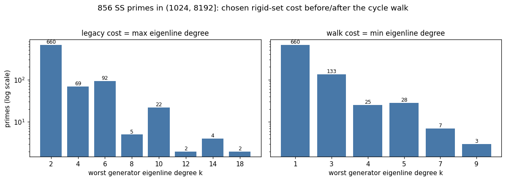
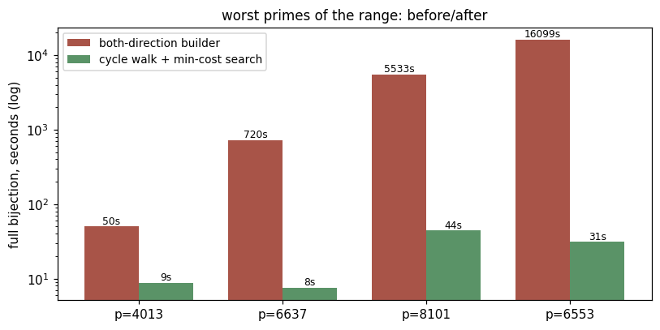
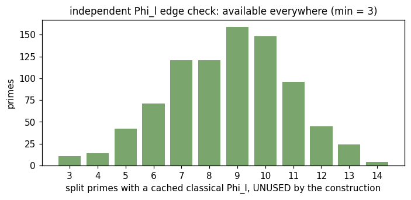

# SS factory — extending the supersingular bijections from p ≤ 1024 to p ≤ 8192

The ordinary side of the store reached 117 155 classes (99.86 % of 4..8192);
the supersingular data stopped at p ≤ 1024 (170 primes).  This folder holds
the factory run notebook plus the experiments (2026-07-05) that shaped it.

## Contents

| file | what |
|---|---|
| `ss_factory.ipynb` | **the run notebook** — Run All fills and validates every missing prime up to 8192 (resumable) |
| `experiments.ipynb` | summary of the experiment session: census histograms, cost calibration, before/after tables |
| `census.py` | the dry census script (re-derivable in ~3 min; `--maxcost` for the legacy cost model) |
| `census_maxcost.json` | census of all 856 primes in (1024, 8192] under the legacy cost model (max eigenline degree) |
| `census_walkcost.json` | the same census under the walk cost model (min eigenline degree) — the worklist the factory actually runs |
| `figs/` | rendered figures (regenerated by `experiments.ipynb`) |

## The experiment arc (one session, 2026-07-05)

**1. Descriptor plumbing (commit `19b1c9d`).**  The rigid-set search had
learned new free-generator descriptors (`('sib', q)`, relaxed `('pin', ...)`)
on the ordinary side, but the SS signature-side data builders only understood
primes and powers — `ecqf_full_bijection_ss(2081)` crashed, and re-runs of
present case-C primes (307) started drawing sib pinning directions.  Fixed:
pins expand into root-only data plus k-step graphs of the basis (no new Velu
work); sib fibers come from the rational 2-isogenies (`two_isogeny_sigs` —
ascend to the surface 2-parent, descend the other legs, all over F_p).  A
latent power-sum bug (1-step data under a k-step key) was fixed in passing.

**2. Dry census.**  All 856 primes in (1024, 8192]: every search succeeds and
every resulting l-set is executable (808 plain-only, 24 pins, 12 sibs, 28
powers, no lift/powkey).  Every prime keeps ≥ 3 *unused* split primes with a
classical Φ_l on disk, so the independent edge check is available everywhere.

**3. Cost calibration.**  Timing single Velu isogenies showed the extension
degree k of the eigenline dominates (l matters little below ~1000): k=4
~0.05 s, k=6 ~2–3 s, k=8 ~6 s, k=10 9–73 s, k=14 ~224 s.  Under the legacy
cost model 35 primes sat at k ≥ 8; naive extrapolation put p=6553 at ~4.5 h
and p=8101 at ~1.5 h.

**4. The one-direction cycle walk (commit `2da1078`).**  The two split
eigenlines live in extensions of *different* degrees — the degree pairs are
always {m, 2m} (m odd) or {2m, 2m} (m even), since the eigenvalues are ±λ.
Stepping the *same* (cheap) eigenvalue never backtracks — the dual isogeny
carries the other eigenvalue — so each coset cycle is recovered by |cycle|
isogenies at the MIN degree instead of 2|cycle| at the max, and the other
direction's neighbour data is read off the cycle for free.
`velu_nbr_data_ss_walk` is byte-identical to the both-direction builder
(verified on 23 (p, l) cases); the rigid search now costs candidates by min
degree.  Effect: 4013 50 s → 8.8 s, 6637 ~12 min → 7.5 s, 8101 ~1.5 h → 44 s,
6553 (the range maximum) ~4.5 h → **31 s**.  Under the walk cost the max
degree anywhere in the range is 9, and 660/856 primes have a degree-1
(rational-eigenline) generator.  Crude total run estimate: **~1.4 h**.

**5. Validation battery (commit `1aa838e`).**  No Sage ground truth exists
past 1024, so `ss_bij_cache.validate_entry` accepts an entry on internal
evidence, each leg independent of the machinery that built it: exact
signature/form sets, genuine supersingularity ((p+1)·P = O on random points),
Φ_l edge verification at an unused split prime (catches a swapped-forms
corruption), and the j=1728 root convention for p ≡ 3 (mod 4).
`populate(validate=True)` refuses to store a failing entry.

## Follow-up: twist-Vélu (landed post-run)

When an eigenvalue has even order 2m, λ^m = −1: kernel x-coordinates live in
F_{p^m} and the kernel points are rational on the quadratic twist, so the
O(l) Vélu sum runs in half the degree; the eigenline projection uses the
relative quadratic extension F_{p^m}[t]/(t²−c) (`QuadExt`, commit `bb93c71`).
The path (`velu_l_isog_codomain_twist`, `b04404d`) is verified to produce
identical codomains, and the walk builder routes even-order directions
through it.  The rigid-set SELECTION deliberately keeps the true min degree:
counting even k as k/2 let giant-l primes jump below small-l ones (the model
is blind to the O(l) Vélu sum) and measurably regressed 1777/6637 — folding
the twist into selection needs a work model (~ l·k²) and a work-cap ladder,
deferred to the next range doubling.  The same commit also replaced the
plain kernel search's O(l) `point_order` verification with an O(log l)
check, a free across-the-board win (4013: 8.8 → 4.0 s, 6553: 31 → 24.6 s).
